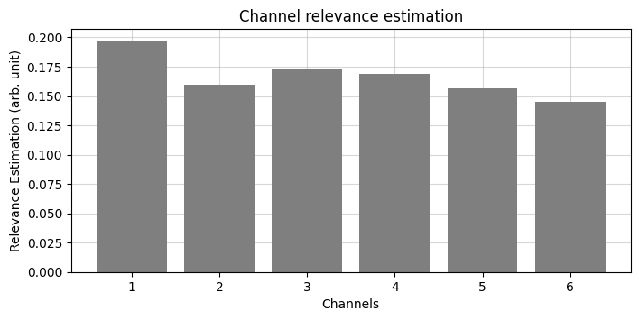

# Detach-ROCKET


Official repository for:

- [Detach-ROCKET: Sequential feature selection for time series classification with random convolutional kernels](https://link.springer.com/article/10.1007/s10618-024-01062-7)
- [Classification of raw MEG/EEG data with detach-rocket ensemble: an improved rocket algorithm for multivariate time series analysis](https://www.arxiv.org/abs/2408.02760)

## Why Detach-ROCKET?

ROCKET models generate thousands of random convolutional features, but most are redundant. Detach-ROCKET automatically prunes them — keeping only the features that matter. The result: **equal or better accuracy, faster inference, and a fraction of the model size.**

| | Full ROCKET | Detach-ROCKET |
|---|---|---|
| Test Accuracy | 79.26% | **81.85%** |
| Features Retained | 100% | **0.69%** |
| Inference Time | 34.66s | **0.47s (73x faster)** |

*FordB dataset (UCR archive) — 10,000 kernels. See the [full example notebook](examples/Detach_ROCKET_example_UCR.ipynb).*

## Overview

Detach-ROCKET applies **Sequential Feature Detachment (SFD)** to ROCKET-family models for time-series classification. It iteratively removes the least important features, selects the optimal model size, and physically rebuilds a smaller, faster transformer. The API follows scikit-learn conventions — just `fit`, `predict`, and `score`.

The library provides four main classes:

- **`DetachRocket`** — End-to-end model: wraps any ROCKET-family transformer (Rocket, MiniRocket, MultiRocket), prunes it with SFD, and rebuilds a smaller transformer for fast inference. Physical kernel rebuilding is currently implemented for sktime's `Rocket` and the CuPy MiniRocket backend; other transformers use an exact feature-masking fallback (identical predictions, without the inference speedup).

- **`DetachEnsemble`** — Ensemble of independently randomized Detach-MiniRocket models. Designed for multivariate time series, especially high-dimensional data (e.g. MEG/EEG). Provides class probability estimation and channel relevance scores. Supports `backend="pytorch"` (CPU/GPU) and `backend="cuda"` (CuPy).

- **`DetachMatrix`** — Applies SFD to any precomputed feature matrix. Use this when your features come from an external pipeline (tsfresh, catch22, or any other transformer).

- **`PrunedRocketModel`** — Lightweight inference-only model returned by `DetachRocket.detach()`. Contains only the pruned transformer, scaler, and classifier — the minimum needed for deployment.

For a detailed explanation of the methods please refer to the [Detach-ROCKET article](https://link.springer.com/article/10.1007/s10618-024-01062-7) and the [Detach-ROCKET Ensemble article](https://www.arxiv.org/abs/2408.02760).

## Features

- Multiclass classification support
- Built-in PyTorch MiniRocket implementation (CPU and GPU)
- CuPy/CUDA MiniRocket backend for maximum GPU throughput
- Detach-ROCKET Ensemble for high-dimensional multivariate time series
- Channel relevance estimation and label probability for multivariate data
- Physical kernel pruning for faster inference via `model.detach()`
- Compatible with any scikit-learn or sktime transformer (not just ROCKET)

## Installation

Install directly from GitHub:

```bash
pip install git+https://github.com/gon-uri/detach_rocket
```

With optional dependencies:

```bash
# DetachEnsemble with PyTorch backend (CPU or CUDA)
pip install "detach_rocket[torch] @ git+https://github.com/gon-uri/detach_rocket"

# DetachEnsemble with CuPy/CUDA backend (requires CUDA GPU)
pip install "detach_rocket[cuda] @ git+https://github.com/gon-uri/detach_rocket"

# Dataset download utilities
pip install "detach_rocket[datasets] @ git+https://github.com/gon-uri/detach_rocket"

# Everything
pip install "detach_rocket[all] @ git+https://github.com/gon-uri/detach_rocket"
```

> **Note:** The `cuda` extra installs `cupy-cuda12x`. If your system uses a different CUDA version, see the [CuPy installation guide](https://docs.cupy.dev/en/stable/install.html).

For development:

```bash
git clone https://github.com/gon-uri/detach_rocket.git
cd detach_rocket
pip install -e ".[dev]"
```

## Quick Start — DetachRocket

The model follows the scikit-learn API: `fit`, `predict`, `score`.

```python
from detach_rocket import DetachRocket
from sktime.transformations.panel.rocket import Rocket

# Instantiate model
rocket = Rocket(num_kernels=10_000)
detach_model = DetachRocket(transformer=rocket, trade_off=0.1)

# Train (validation set required when set_percentage=None)
detach_model.fit(X_train, y_train, X_val=X_val, y_val=y_val)

# Evaluate
y_pred = detach_model.predict(X_test)
test_acc = detach_model.score(X_test, y_test)
full_model_acc = detach_model.score_full(X_test, y_test)  # Unpruned baseline
summary = detach_model.get_summary()

# Export lightweight model for deployment
pruned_model = detach_model.detach()
y_pred = pruned_model.predict(X_new)
```

If you prefer a fixed pruning level, pass `set_percentage` and fit without a validation set:

```python
detach_model = DetachRocket(transformer=rocket, set_percentage=50)
detach_model.fit(X_train, y_train)
```

**Input shapes:**
- Univariate: `(n_instances, 1, n_timepoints)` — with sktime transformers, 2D `(n_instances, n_timepoints)` also works
- Multivariate: `(n_instances, n_channels, n_timepoints)`
- The MiniRocket backends used by `DetachEnsemble` require the 3D form

## Quick Start — DetachEnsemble

Ensemble of Detach-MiniRocket models for multivariate time series. Provides class probability and channel relevance estimation.

```python
from detach_rocket import DetachEnsemble

# Create ensemble (use backend="cuda" for CuPy/CUDA acceleration)
ensemble = DetachEnsemble(
    num_models=20,
    num_kernels=5_000,
    backend="pytorch",
)

# Train and predict
ensemble.fit(X_train, y_train)
y_pred = ensemble.predict(X_test)

# Class probabilities (soft voting weighted by training accuracy)
probs = ensemble.predict_proba(X_test, proba="soft")

# Channel relevance estimation
channel_relevance = ensemble.estimate_channel_relevance()
```

<p align="center">
  
</p>

## Quick Start — DetachMatrix

Apply SFD to any precomputed feature matrix — works with tsfresh, catch22, or any feature extraction pipeline.

```python
from detach_rocket import DetachMatrix

# X_features: (n_instances, n_features) — any feature matrix
model = DetachMatrix(trade_off=0.1)
model.fit(X_features, y, X_val=X_features_val, y_val=y_val)

y_pred = model.predict(X_features_test)
test_acc = model.score(X_features_test, y_test)
```

## Notebook Examples

Detailed usage examples are available in the [examples folder](examples/):

- **[Detach-ROCKET (UCR)](examples/Detach_ROCKET_example_UCR.ipynb)** — Univariate classification with Rocket on the FordB dataset. Includes SFD curve visualization, accuracy and inference time comparison.
- **[Detach-ROCKET Ensemble (UEA)](examples/Detach_Ensemble_example_UEA.ipynb)** — Multivariate classification on an EEG dataset (SelfRegulationSCP1). Demonstrates channel relevance estimation.
- **[SFD with tsfresh](examples/SFD_example_tsfresh.ipynb)** — Feature selection on tsfresh features using `DetachMatrix`, showing that SFD works with any feature pipeline.

## Core Modules

- `detach_rocket/detach_classes.py`: Main model classes (`DetachRocket`, `DetachMatrix`, `DetachEnsemble`, `PrunedRocketModel`).
- `detach_rocket/sfd.py`: Sequential Feature Detachment core logic (`feature_detachment`).
- `detach_rocket/model_selection.py`: Model-size selection and final retraining utilities.
- `detach_rocket/pruner.py`: Transformer pruning — physical rebuild for Rocket and CUDA MiniRocket, generic masking fallback for everything else.
- `detach_rocket/pytorch_minirocket.py`: PyTorch MiniRocket implementation (CPU/GPU).
- `detach_rocket/cuda_minirocket.py`: CuPy/CUDA MiniRocket implementation.
- `detach_rocket/utils_datasets.py`: UCR/UEA dataset download helpers.

## Migrating from 0.0.x

Version 0.1.0 is a rewrite with a cleaner, scikit-learn-style API. The main breaking changes:

| 0.0.x | 0.1.0 |
|---|---|
| `DetachRocket(model_type="rocket", num_kernels=10000)` | `DetachRocket(transformer=Rocket(num_kernels=10_000))` — pass any transformer instance |
| `fit(X, y)` with a silent internal train/val split | Explicit `fit(X, y, X_val=..., y_val=...)`, or `set_percentage=...` to skip validation |
| `score(X, y)` returned a `(pruned_acc, full_acc)` tuple | `score(X, y)` returns a float; the unpruned baseline is `score_full(X, y)` |
| Private attributes (`_feature_matrix`, `_classifier`, ...) | scikit-learn style public attributes (`feature_matrix_`, `classifier_`, ...) |
| `multilabel_type` | `multiclass_type` (renamed; default remains `"max"`, as in the paper) |
| `utils.py` (`feature_detachment`, `select_optimal_model` with built-in plotting) | `sfd.py` (`feature_detachment`) and `model_selection.py` (`select_optimal_pruning`, plotting moved to the notebooks) |

New in 0.1.0: `DetachEnsemble` with PyTorch and CuPy/CUDA MiniRocket backends, physical transformer pruning, `detach()` for lightweight deployment models, and channel relevance estimation.

Two behavior fixes worth knowing: 0.0.x retrained the final classifier on the feature set of the step *before* the selected one (an off-by-one in the mask reconstruction) and fitted the scaler before the internal train/val split; 0.1.0 retrains exactly the selected feature set and keeps validation data out of the scaler fit.

## Troubleshooting

**`llvmlite` fails to build during `pip install`.** This happens on platforms where the newest `numba` release has no pre-built wheel (e.g. Intel Macs, or x86_64/Rosetta condas on Apple Silicon), so pip tries to compile it from source. Tell pip to prefer wheels over newer source releases:

```bash
pip install --prefer-binary git+https://github.com/gon-uri/detach_rocket
```

Alternatively, install `numba` from conda first and then install the package:

```bash
conda install "numba>=0.58"
pip install git+https://github.com/gon-uri/detach_rocket
```

**`RuntimeError: Numpy is not available` from torch (Intel Mac / Rosetta conda).** The newest torch wheel for macOS x86_64 is 2.2.2, which requires `numpy<2`. The `[torch]` extra pins this automatically on that platform; in a pre-existing environment, run `pip install "numpy<2"`.

**`Intel MKL WARNING` about SSE4.2/AVX** (conda installs MKL by default):

```bash
conda install nomkl
```

## License

This project is licensed under the BSD-3-Clause License.

## Citation

If you find these methods useful in your research, please cite the following articles:

*APA*
```
Uribarri, G., Barone, F., Ansuini, A., & Fransén, E. (2024). Detach-ROCKET: Sequential feature selection for time series classification with random convolutional kernels. Data Mining and Knowledge Discovery, 1-26.

Solana, A., Fransén, E., & Uribarri, G. (2024). Classification of raw MEG/EEG data with detach-rocket ensemble: an improved rocket algorithm for multivariate time series analysis. arXiv preprint arXiv:2408.02760.
```

*BIBTEX*
```bibtex
@article{uribarri2024detach,
  title={Detach-ROCKET: Sequential feature selection for time series classification with random convolutional kernels},
  author={Uribarri, Gonzalo and Barone, Federico and Ansuini, Alessio and Frans{\'e}n, Erik},
  journal={Data Mining and Knowledge Discovery},
  pages={1--26},
  year={2024},
  publisher={Springer}
}

@article{solana2024classification,
  title={Classification of raw MEG/EEG data with detach-rocket ensemble: an improved rocket algorithm for multivariate time series analysis},
  author={Solana, Adri{\`a} and Frans{\'e}n, Erik and Uribarri, Gonzalo},
  journal={arXiv preprint arXiv:2408.02760},
  year={2024}
}
```


